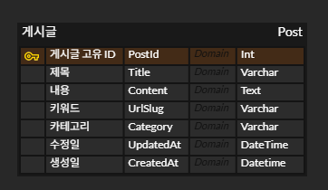

# WebAppBlog

.NET Framework 학습 블로그   
매일 학습한 내용을 간략하게 키워드 위주로 작성한 뒤, 키워드에 디테일한 내용을 연결해 주는 블로그   

> 학습한 내용을 적용하여 기술 스택과 프로젝트의 방향성이 계속해서 변경될 예정   

## 기간

2025.09.15 ~

## 기술 스택

언어: C#   
프레임워크: .NET Core MVC, EF Framework   
프론트: Razor, Javascript, HTML, CSS   
데이터베이스: SQL Server (LocalDB)   

## ERD

**[[ERD Cloud](https://www.erdcloud.com/d/xFkPLkyNxSqN8CP4a)]**   
   

## 해결해야할 문제

- **마크다운 작성**: 게시판 작성 시 마크다운 형식으로 작성하고, 작성된 게시글을 읽을 때 마크다운으로 렌더링   
- **Slug(Keyword) 자동 변환**: 작성된 글의 키워드를 자동 변환하여 DB Table Field값으로 저장   
- **화면 분활 화면 분할**: 원 포스팅 글과 궁금한 키워드를 누르면 좌 / 우로 화면 분할하여 좌측에는 본 포스팅, 우측에는 키워드 포스팅 제공   
- **LLM 접목**: 궁금한 키워드 포스팅이 없을 경우, LLM으로 대체하여 제공   

